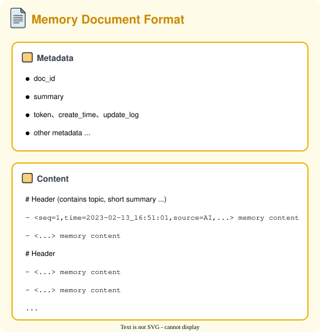

# Infini Memory

[](https://pypi.org/project/infini-memory/)
[](https://pypi.org/project/infini-memory/)
[](LICENSE)
[](https://arxiv.org/abs/2606.10677)

[English](README.md) | **中文**

一种可维护的、基于文本的持久化记忆架构，将 LLM 代理记忆组织为主题结构化文档。

[[论文](https://arxiv.org/abs/2606.10677)]

## 简介

长期运行的 LLM 代理需要能够跨会话追踪变化事实并提供相关证据的持久化记忆。现有的记忆系统通常将观察结果存储为孤立的记录、摘要或索引片段，这导致了四个反复出现的问题：

- **记忆碎片化**：关于同一用户、任务或事件的证据分散在大量小记录中
- **记忆冲突**：较新的观察与较旧的观察矛盾，但追加式存储让两个版本都可被检索
- **压缩损失**：摘要化削弱了时间顺序和来源线索
- **检索不足**：单步检索返回孤立的片段，而非足以支持多跳推理的证据

Infini Memory 将持久化记忆视为一个**生命周期维护问题**，围绕三个耦合操作展开——**写入**、**维护**和**读取**。它将记忆表示为主题结构化文档，每个文档将相关证据分组到一个共享主题下，并携带条目级元数据（序列号、时间戳、来源标签），在内容被重写时保留时间和来源线索。

### 核心设计

- **主题文档作为记忆载体**：以纯文本 Markdown 文档按主题组织，不依赖向量或图数据库
- **缓冲写入与定期整合**：高频写入追加到 `CURRENT` 缓冲区；当积累了一定的信息或者到了一定时间阈值后才触发整合（重写、拆分、更新、合并）
- **代理式检索**：LLM 通过记忆工具迭代搜索、验证和扩展证据，而非依赖单次检索步骤
- **文件系统后端**：无需外部基础设施——记忆状态保持可读、可编辑和可移植

## 快速开始

### 安装

```bash
pip install infini-memory
```

Infini Memory 需要 LLM 才能运行，默认使用 OpenAI 的 `gpt-5-mini`。设置 API 密钥：

```bash
export OPENAI_API_KEY="sk-..."
```

### chat_with_memory 示例

可运行的示例代码位于 [`examples/chat_with_memory.py`](examples/chat_with_memory.py)。

运行样例：

```text
uv run python examples/chat_with_memory.py
Chat with AI (type 'exit' to quit)

You: 我的名字是什么？
AI: 我不知道你的名字，除非你告诉我。你愿意现在告诉我吗？还可以说你想我在本次对话中怎么称呼你，或者是否希望我记住（如果你不想说也没问题，我可以用"你"或其他称呼）。

You: 我的名字是Jay
AI: 好的，Jay，我会在本次对话中这样称呼你。你希望我把这个名字记住，以便下次也能认出你吗？还是更喜欢其他称呼？你随时可以改。

You: exit
Goodbye!
```

```text
uv run python examples/chat_with_memory.py
Chat with AI (type 'exit' to quit)

You: 我的名字是什么？
AI: 你的名字是 Jay。我会在对话中这么称呼你；如果想改或不想我记住，随时告诉我。

You: 我喜欢吃什么食物？
AI: 我还不知道你喜欢吃什么——目前记忆里只有你的名字 Jay。你可以告诉我你的口味喜好，我就能给出更贴合的建议，或者把这些偏好记住以便下次使用（需要你的同意）。

You: 我喜欢蓝莓和草莓
AI: 太好了，Jay！你喜欢蓝莓和草莓——很棒的搭配。要不要我把"喜欢蓝莓和草莓"记到你的偏好里，以后给你推荐时优先考虑？

You: exit
Goodbye!
```

```text
uv run python examples/chat_with_memory.py
Chat with AI (type 'exit' to quit)

You: 我的名字和喜好
AI: 你在我这里的记录是：
- 名字：Jay
- 喜好：喜欢蓝莓和草莓（已记住）

需要我修改或补充这些信息吗？要我以后优先按这些偏好给你推荐食谱或点餐建议吗？
```

> **说明：** `chat_with_memory.py` 仅为记忆效果展示，每一轮对话都会提取记忆。实际使用时，可以累积多轮对话后再一起提取记忆，以减少 LLM 调用次数。

## 文档管理

`Memory` 类提供完整的文档 CRUD 操作和用户管理功能：

```python
from infini_memory import Memory

memory = Memory()

# 列出用户的所有文档（仅元数据）
docs = memory.list(user_id="alice")

# 获取所有文档（含内容）
all_docs = memory.get_all(user_id="alice")

# 通过 ID 获取特定文档
doc = memory.get("2025-01-15_14-30-00_abc123", user_id="alice")
print(doc["content"], doc["summary"])

# 更新文档
memory.update("2025-01-15_14-30-00_abc123", "新内容", "新摘要", user_id="alice")

# 删除文档
memory.delete("2025-01-15_14-30-00_abc123", user_id="alice")

# 文档数量与统计
n = memory.count(user_id="alice")
stats = memory.stats(user_id="alice")  # {"total_docs", "avg_tokens", ...}

# 操作历史
events = memory.history(user_id="alice")

# 删除所有文档（保留用户目录）
memory.delete_all(user_id="alice")

# 列出所有用户
users = memory.list_users()  # ["alice", "bob", ...]

# 删除用户的所有数据
memory.delete_user("alice")

# 重置：删除所有用户的所有数据
memory.reset()
```

## 配置

### 编程方式（推荐用于库集成）

```python
from infini_memory import Memory

memory = Memory(
    api_key="sk-...",                      # 或设置 OPENAI_API_KEY 环境变量
    base_url="https://api.openai.com/v1",  # 自定义端点
    model="gpt-5-mini",                   # LLM 模型
    data_root="my_memory_data",            # 文档存储位置
    search_strategy="AGENTIC",             # 检索策略
    markdown_length=2000,                  # 文档拆分 token 阈值
)
```

### TOML 配置文件（用于独立部署）

```python
from pathlib import Path
from infini_memory import InfiniMemory, InfiniMemoryConfig

cfg = InfiniMemoryConfig(config_file=Path("config/config.toml"))
mem = InfiniMemory()

mem.add(messages, user_id="user_001", cfg=cfg)
result = mem.search("query", user_id="user_001", cfg=cfg)
```

`config.toml` 中的关键字段：

```toml
[llm]
openai_api_key = "sk-..."
model = "gpt-5-mini"

[memory]
enabled = true
data_root = "data"
markdown_length = 1000
search_strategy = "AGENTIC"
```

## 架构

### 主题文档格式

Infini Memory 将持久化记忆存储为主题文档，每个文档将相关的事实、偏好和事件线索分组到一个共享主题下。文档包含元数据头（`id`、`summary`、`token_count`、`created_time`、`update_log`、`aux`）和分层正文。正文使用主题和子主题标题来组织记忆条目，每个条目以可解析的签名 `<seq=..., time=..., source=...>` 作为前缀，保留时间顺序、来源信息和修订上下文。

<p align="center">
  
</p>

### 写入路径

写入与整合流水线将高频写入与低频结构维护分离。新记忆首先追加到 `CURRENT` 缓冲区，然后定期整合到主题文档库中。

<p align="center">
  
</p>

1. **提取**：LLM 从对话中提取关键信息，转为结构化 Markdown
2. **追加**：新内容追加到 `CURRENT` 缓冲文档
3. **重写**：当缓冲区超过 token 阈值或时间窗口时，按主题聚合内容为 `REWRITE_CURRENT`
4. **拆分更新**：规划器将重写后的内容路由到主题文档（新建或更新已有文档），解决矛盾并保留元数据
5. **合并**：相似主题的小文档定期合并，刷新摘要和元数据

### 读取路径

Infini Memory 支持两种检索变体。

**混合检索（LLM 摘要 + BM25 分区）：** LLM 通过摘要相关性选择候选文档，BM25 从剩余文档中补充词法匹配的分区。

<p align="center">
  
</p>

**智能检索（Agentic Retrieval）：** LLM 代理迭代调用记忆工具（`grep`、`grep_doc`、`search`、`list_docs`、`read_lines`）来搜索、验证和扩展主题文档和 `CURRENT` 缓冲区中的证据，然后生成最终回答。当智能体返回的证据不足时，BM25 分区检索会补充结果。

<p align="center">
  
</p>

## 引用

```bibtex
@misc{ji2026infinimemorymaintainabletopic,
      title={Infini Memory: Maintainable Topic Documents for Long-Term LLM Agent Memory}, 
      author={Suozhao Ji and Baodong Wu and Zehao Wang and Lei Xia and Qingping Li and Ruisong Wang and Wenbo Ding and Zhenhua Zhu and Boxun Li and Guohao Dai and Yu Wang},
      year={2026},
      eprint={2606.10677},
      archivePrefix={arXiv},
      primaryClass={cs.AI},
      url={https://arxiv.org/abs/2606.10677}, 
}
```

## 许可证

[Apache License 2.0](LICENSE)
